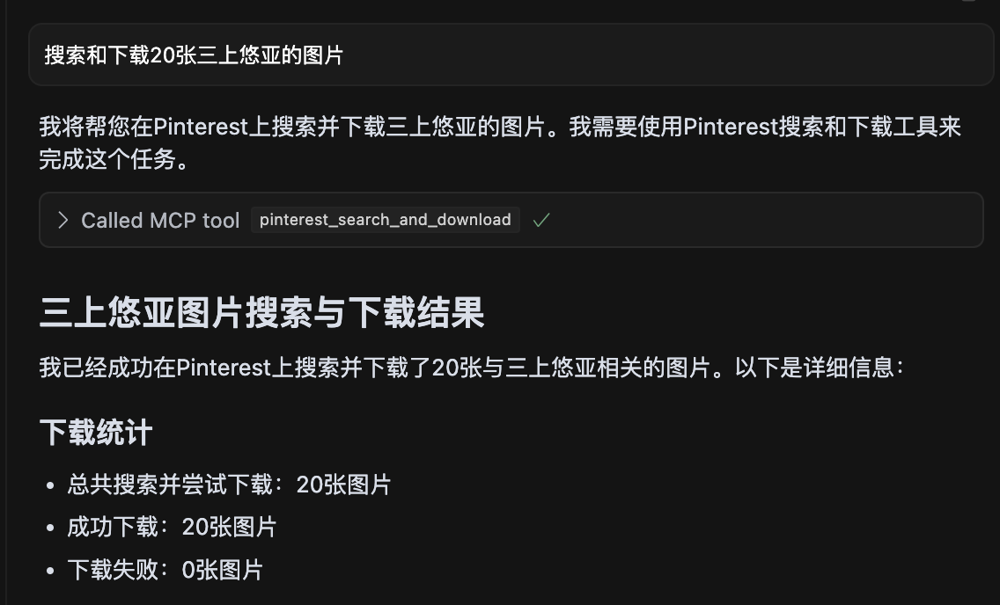

# Pinterest MCP Server

[](https://smithery.ai/server/mcp-pinterest)

A Model Context Protocol (MCP) server for Pinterest image search and information retrieval.

## Features

- Search for images on Pinterest by keywords
- Retrieve detailed information about Pinterest images
- Seamless integration with Cursor IDE through MCP
- Support for headless browser mode
- Limit control for search results
- Search and download images from Pinterest

## Prerequisites

- [Node.js](https://nodejs.org/) (v18 or higher)
- [Cursor IDE](https://cursor.sh/) for MCP integration

## Installation

### Installing via Smithery

To install mcp-pinterest for Claude Desktop automatically via [Smithery](https://smithery.ai/server/mcp-pinterest):

```bash
npx -y @smithery/cli install mcp-pinterest --client claude
```

### Manual

1. Clone this repository:
   ```bash
   git clone https://github.com/terryso/mcp-pinterest.git pinterest-mcp-server
   cd pinterest-mcp-server
   ```

2. Install dependencies:
   ```bash
   npm install
   ```

## Usage

### Command Mode (Recommended)

Build the server:
```bash
npm run build
```

You can now use this server as an MCP server in Cursor.

## Configuring as MCP Server in Cursor

1. Open Cursor IDE
2. Go to Settings (⚙️) > Extensions > MCP
3. Click "Add Server"
4. Enter the following details:
   - Name: Pinterest MCP
   - Type: Command
   - Command: `node`
   - Args: `["/path/to/mcp-pinterest/dist/pinterest-mcp-server.js"]`

   或者直接编辑Cursor的MCP配置文件（通常位于`~/.cursor/mcp.json`），添加以下内容：
   ```json
   "pinterest": {
     "command": "node",
     "args": ["/path/to/mcp-pinterest/dist/pinterest-mcp-server.js"]
   }
   ```
5. Click "Save"

## Available MCP Functions

The server exposes the following MCP functions:

- `pinterest_search`: Search for images on Pinterest by keyword
  - Parameters:
    - `keyword`: Search term (required)
    - `limit`: Number of images to return (default: 10)
    - `headless`: Whether to use headless browser mode (default: true)

- `pinterest_get_image_info`: Get detailed information about a Pinterest image
  - Parameters:
    - `image_url`: URL of the Pinterest image (required)

- `pinterest_search_and_download`: Search and download images from Pinterest
  - Parameters:
    - `keyword`: Search term (required)
    - `limit`: Number of images to return (default: 10)
    - `headless`: Whether to use headless browser mode (default: true)

## Example Usage in Cursor

Once configured, you can use the Pinterest MCP functions directly in Cursor's AI chat:

```
Search for robot images on Pinterest
```

The AI will use the MCP server to search Pinterest and display the results.

### Example Screenshot



*Screenshot showing a search for 20 images of 三上悠亚 with all images successfully downloaded.*

## Development

### Project Structure

- `pinterest-mcp-server.ts`: Main server file
- `dist/pinterest-mcp-server.js`: Built JavaScript file for production
- `package.json`: Project configuration and dependencies

### Adding New Features

To add new MCP functions:

1. Modify `pinterest-mcp-server.ts`
2. Register new functions using the MCP SDK
3. Implement the function logic
4. Rebuild with `npm run build`

## Troubleshooting

- If the server fails to start, check if the port is already in use
- Ensure all dependencies are correctly installed with `npm install`
- Make sure TypeScript is properly configured with a `tsconfig.json` file
- If you encounter build errors, try running `npm install -D typescript @types/node`
- Verify network connectivity for Pinterest access

## License

This project is licensed under the MIT License - see the [LICENSE](LICENSE) file for details.

## Configuration Options

### Environment Variables

The server supports the following environment variables for configuration:

- `MCP_PINTEREST_DOWNLOAD_DIR`: Specifies the root directory for downloading images. If not set, the default is the `../downloads` directory relative to the server script.

### Usage

#### Setting Download Directory

1. Set the download directory using an environment variable (recommended method):

```bash
# Linux/macOS
export MCP_PINTEREST_DOWNLOAD_DIR=/path/to/your/download/directory
# Then start the server
node pinterest-mcp-server.js

# Windows (CMD)
set MCP_PINTEREST_DOWNLOAD_DIR=C:\path\to\your\download\directory
# Then start the server
node pinterest-mcp-server.js

# Windows (PowerShell)
$env:MCP_PINTEREST_DOWNLOAD_DIR="C:\path\to\your\download\directory"
# Then start the server
node pinterest-mcp-server.js
```

2. If the environment variable is not set, the server will use the default download directory (relative to the server script's `../downloads`).

#### Notes

- The server will verify the existence and writability of the download directory when starting. If the directory does not exist, it will attempt to create it; if it cannot be created or written to, the server will exit.
- Clients should not specify download paths through parameters when calling download-related tools, as all downloads will be saved in the directory specified by the environment variable or the default directory.

#### Interface Description

The server provides the following MCP tools:

1. `pinterest_search`: Search for Pinterest images by keyword
2. `pinterest_get_image_info`: Get detailed information about a Pinterest image
3. `pinterest_search_and_download`: Search and download Pinterest images

For detailed interface parameter references, please refer to the MCP tool definitions. 